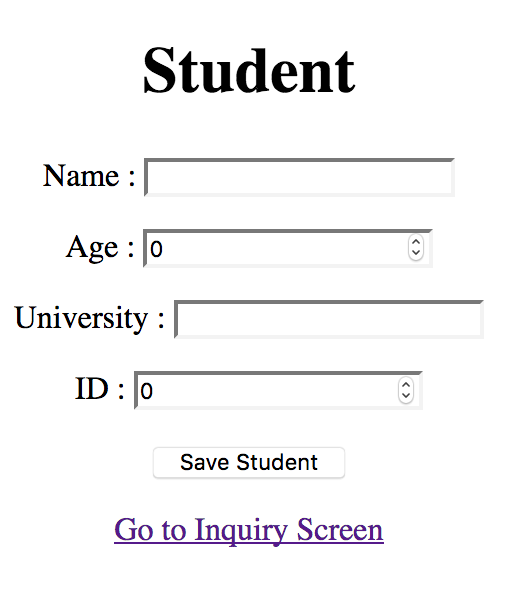

# StudentSystemwithJson

In your browser go to this url 
localhost:10432 
 
Our home page record student with datas. main.go write data to students.txt.  
And go the inquiry screen  
 
we can find student with id.
